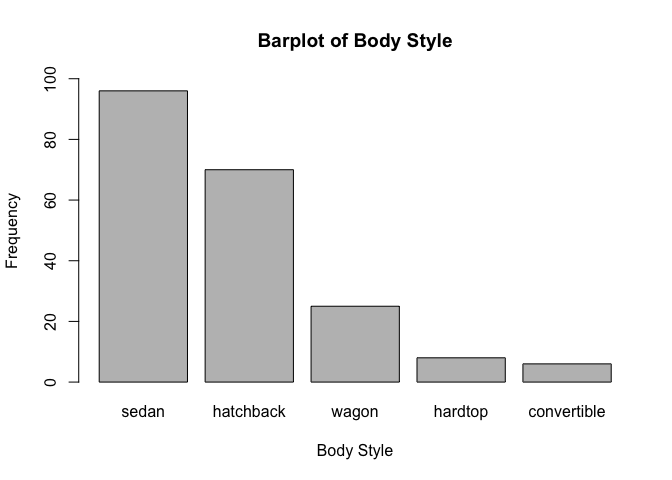
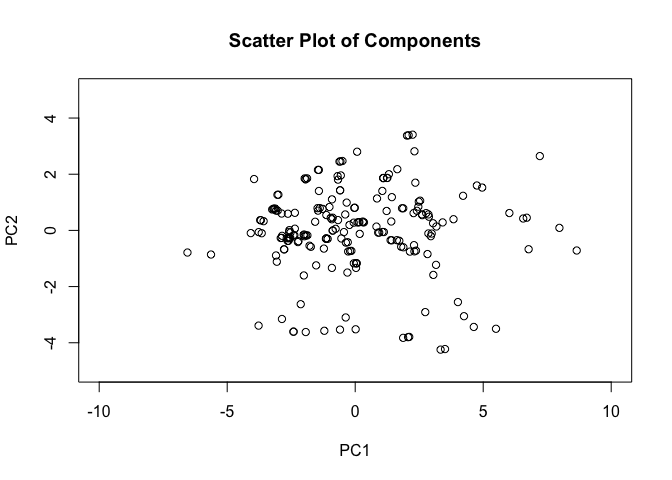

hw01-kanak-garg
================
Kanak Garg
2/20/2018

``` r
library(readr)
library(corrplot)
```

    ## corrplot 0.84 loaded

Data Import
-----------

``` r
column_names <- c("symboling", "normalized_losses", "make", "fuel_type", "aspiration", "num_of_doors", "body_style", "drive_wheels", "engine_location", "wheel_base", "length", "width", "height", "curb_weight", "engine_type", "num_of_cylinders", "engine_size", "fuel_system", "bore", "stroke", "compression_ratio", "horsepower", "peak_rpm", "city_mpg", "highway_mpg", "price")

column_types <- c(
    'real', 'real', 'character', 'character', 'character', 'character', 'character', 'character', 'character', 'real', 'real', 'real', 'real', 'integer', 'character', 'character', 'integer', 'character', 'character', 'character', 'real', 'integer', 'integer', 'integer', 'integer', 'integer')

data <- read.table('imports-85.data', col.names = column_names, colClasses = column_types, sep = ",", na.strings = "?")

str(data)
```

    ## 'data.frame':    205 obs. of  26 variables:
    ##  $ symboling        : num  3 3 1 2 2 2 1 1 1 0 ...
    ##  $ normalized_losses: num  NA NA NA 164 164 NA 158 NA 158 NA ...
    ##  $ make             : chr  "alfa-romero" "alfa-romero" "alfa-romero" "audi" ...
    ##  $ fuel_type        : chr  "gas" "gas" "gas" "gas" ...
    ##  $ aspiration       : chr  "std" "std" "std" "std" ...
    ##  $ num_of_doors     : chr  "two" "two" "two" "four" ...
    ##  $ body_style       : chr  "convertible" "convertible" "hatchback" "sedan" ...
    ##  $ drive_wheels     : chr  "rwd" "rwd" "rwd" "fwd" ...
    ##  $ engine_location  : chr  "front" "front" "front" "front" ...
    ##  $ wheel_base       : num  88.6 88.6 94.5 99.8 99.4 ...
    ##  $ length           : num  169 169 171 177 177 ...
    ##  $ width            : num  64.1 64.1 65.5 66.2 66.4 66.3 71.4 71.4 71.4 67.9 ...
    ##  $ height           : num  48.8 48.8 52.4 54.3 54.3 53.1 55.7 55.7 55.9 52 ...
    ##  $ curb_weight      : int  2548 2548 2823 2337 2824 2507 2844 2954 3086 3053 ...
    ##  $ engine_type      : chr  "dohc" "dohc" "ohcv" "ohc" ...
    ##  $ num_of_cylinders : chr  "four" "four" "six" "four" ...
    ##  $ engine_size      : int  130 130 152 109 136 136 136 136 131 131 ...
    ##  $ fuel_system      : chr  "mpfi" "mpfi" "mpfi" "mpfi" ...
    ##  $ bore             : chr  "3.47" "3.47" "2.68" "3.19" ...
    ##  $ stroke           : chr  "2.68" "2.68" "3.47" "3.40" ...
    ##  $ compression_ratio: num  9 9 9 10 8 8.5 8.5 8.5 8.3 7 ...
    ##  $ horsepower       : int  111 111 154 102 115 110 110 110 140 160 ...
    ##  $ peak_rpm         : int  5000 5000 5000 5500 5500 5500 5500 5500 5500 5500 ...
    ##  $ city_mpg         : int  21 21 19 24 18 19 19 19 17 16 ...
    ##  $ highway_mpg      : int  27 27 26 30 22 25 25 25 20 22 ...
    ##  $ price            : int  13495 16500 16500 13950 17450 15250 17710 18920 23875 NA ...

``` r
column2_types <- c( col_double(), col_double(), col_character(), col_character(), col_character(), col_character(), col_character(), col_character(), col_character(), col_double(), col_double(), col_double(), col_double(), col_integer(), col_character(), col_character(), col_integer(), col_character(), col_character(), col_character(), col_double(), col_integer(), col_integer(), col_integer(), col_integer(), col_integer())

data2 <- read_csv('imports-85.data', col_names = column_names, col_types = column2_types,  na = "?")

str(data2)
```

    ## Classes 'tbl_df', 'tbl' and 'data.frame':    205 obs. of  26 variables:
    ##  $ symboling        : int  3 3 1 2 2 2 1 1 1 0 ...
    ##  $ normalized_losses: int  NA NA NA 164 164 NA 158 NA 158 NA ...
    ##  $ make             : chr  "alfa-romero" "alfa-romero" "alfa-romero" "audi" ...
    ##  $ fuel_type        : chr  "gas" "gas" "gas" "gas" ...
    ##  $ aspiration       : chr  "std" "std" "std" "std" ...
    ##  $ num_of_doors     : chr  "two" "two" "two" "four" ...
    ##  $ body_style       : chr  "convertible" "convertible" "hatchback" "sedan" ...
    ##  $ drive_wheels     : chr  "rwd" "rwd" "rwd" "fwd" ...
    ##  $ engine_location  : chr  "front" "front" "front" "front" ...
    ##  $ wheel_base       : num  88.6 88.6 94.5 99.8 99.4 ...
    ##  $ length           : num  169 169 171 177 177 ...
    ##  $ width            : num  64.1 64.1 65.5 66.2 66.4 66.3 71.4 71.4 71.4 67.9 ...
    ##  $ height           : num  48.8 48.8 52.4 54.3 54.3 53.1 55.7 55.7 55.9 52 ...
    ##  $ curb_weight      : int  2548 2548 2823 2337 2824 2507 2844 2954 3086 3053 ...
    ##  $ engine_type      : chr  "dohc" "dohc" "ohcv" "ohc" ...
    ##  $ num_of_cylinders : chr  "four" "four" "six" "four" ...
    ##  $ engine_size      : int  130 130 152 109 136 136 136 136 131 131 ...
    ##  $ fuel_system      : chr  "mpfi" "mpfi" "mpfi" "mpfi" ...
    ##  $ bore             : num  3.47 3.47 2.68 3.19 3.19 3.19 3.19 3.19 3.13 3.13 ...
    ##  $ stroke           : num  2.68 2.68 3.47 3.4 3.4 3.4 3.4 3.4 3.4 3.4 ...
    ##  $ compression_ratio: num  9 9 9 10 8 8.5 8.5 8.5 8.3 7 ...
    ##  $ horsepower       : int  111 111 154 102 115 110 110 110 140 160 ...
    ##  $ peak_rpm         : int  5000 5000 5000 5500 5500 5500 5500 5500 5500 5500 ...
    ##  $ city_mpg         : int  21 21 19 24 18 19 19 19 17 16 ...
    ##  $ highway_mpg      : int  27 27 26 30 22 25 25 25 20 22 ...
    ##  $ price            : int  13495 16500 16500 13950 17450 15250 17710 18920 23875 NA ...
    ##  - attr(*, "spec")=List of 2
    ##   ..$ cols   :List of 26
    ##   .. ..$ symboling        : list()
    ##   .. .. ..- attr(*, "class")= chr  "collector_integer" "collector"
    ##   .. ..$ normalized_losses: list()
    ##   .. .. ..- attr(*, "class")= chr  "collector_integer" "collector"
    ##   .. ..$ make             : list()
    ##   .. .. ..- attr(*, "class")= chr  "collector_character" "collector"
    ##   .. ..$ fuel_type        : list()
    ##   .. .. ..- attr(*, "class")= chr  "collector_character" "collector"
    ##   .. ..$ aspiration       : list()
    ##   .. .. ..- attr(*, "class")= chr  "collector_character" "collector"
    ##   .. ..$ num_of_doors     : list()
    ##   .. .. ..- attr(*, "class")= chr  "collector_character" "collector"
    ##   .. ..$ body_style       : list()
    ##   .. .. ..- attr(*, "class")= chr  "collector_character" "collector"
    ##   .. ..$ drive_wheels     : list()
    ##   .. .. ..- attr(*, "class")= chr  "collector_character" "collector"
    ##   .. ..$ engine_location  : list()
    ##   .. .. ..- attr(*, "class")= chr  "collector_character" "collector"
    ##   .. ..$ wheel_base       : list()
    ##   .. .. ..- attr(*, "class")= chr  "collector_double" "collector"
    ##   .. ..$ length           : list()
    ##   .. .. ..- attr(*, "class")= chr  "collector_double" "collector"
    ##   .. ..$ width            : list()
    ##   .. .. ..- attr(*, "class")= chr  "collector_double" "collector"
    ##   .. ..$ height           : list()
    ##   .. .. ..- attr(*, "class")= chr  "collector_double" "collector"
    ##   .. ..$ curb_weight      : list()
    ##   .. .. ..- attr(*, "class")= chr  "collector_integer" "collector"
    ##   .. ..$ engine_type      : list()
    ##   .. .. ..- attr(*, "class")= chr  "collector_character" "collector"
    ##   .. ..$ num_of_cylinders : list()
    ##   .. .. ..- attr(*, "class")= chr  "collector_character" "collector"
    ##   .. ..$ engine_size      : list()
    ##   .. .. ..- attr(*, "class")= chr  "collector_integer" "collector"
    ##   .. ..$ fuel_system      : list()
    ##   .. .. ..- attr(*, "class")= chr  "collector_character" "collector"
    ##   .. ..$ bore             : list()
    ##   .. .. ..- attr(*, "class")= chr  "collector_double" "collector"
    ##   .. ..$ stroke           : list()
    ##   .. .. ..- attr(*, "class")= chr  "collector_double" "collector"
    ##   .. ..$ compression_ratio: list()
    ##   .. .. ..- attr(*, "class")= chr  "collector_double" "collector"
    ##   .. ..$ horsepower       : list()
    ##   .. .. ..- attr(*, "class")= chr  "collector_integer" "collector"
    ##   .. ..$ peak_rpm         : list()
    ##   .. .. ..- attr(*, "class")= chr  "collector_integer" "collector"
    ##   .. ..$ city_mpg         : list()
    ##   .. .. ..- attr(*, "class")= chr  "collector_integer" "collector"
    ##   .. ..$ highway_mpg      : list()
    ##   .. .. ..- attr(*, "class")= chr  "collector_integer" "collector"
    ##   .. ..$ price            : list()
    ##   .. .. ..- attr(*, "class")= chr  "collector_integer" "collector"
    ##   ..$ default: list()
    ##   .. ..- attr(*, "class")= chr  "collector_guess" "collector"
    ##   ..- attr(*, "class")= chr "col_spec"

Technical Questions about Importing Data
----------------------------------------

1.  Provided the code contains a "sep" clause, the data would result in taking the first line of data and converting that into the column name values.

2.  When the header is set to false, instead of using the first row as the column name values, each column is given a numbered vector name, ranging from "V1" to "Vn", and all data is stored regularly.

3.  If given a column data type, the data will fail to read and will error out. If not given, a column data type, the columns data type will be automatically assumed to be as a "character."

4.  When given column types, each variable in the column is assigned to the column type and extra data is used to store the new information. It makes sense that more data is used when assigned column types rather than not.

5.  It keeps all the data types and the values in a matrix with all the data. Nothing changes, except for a lack of column names.

Practice Base Plotting
----------------------

Histogram

``` r
hist(data$price, freq = TRUE, col ="grey", border = "black", main = "Histogram Of Price", xlab = "Price", ylab = "Counts", labels = TRUE, ylim = c(0, 125), xlim = c(0, 50000))
```


Almost half of the cars are priced betweeon $0 and $10000, while the other half is above $10000. The center and the mean of the histogram plot seems to lie somewhere between $10000 and $15000. This graph is heavily skewed to the right and has a large spread.

Boxplot

``` r
boxplot(data$horsepower, horizontal = TRUE, col = "grey", main = "Boxplot of Horsepower", xlab = "Horsepower", ylim = c(0, 300))
```


The boxplot is a almost symmetric, slightly right-skewed graph with its center at around a 100 horsepower and a spread at almsot 125 horespower. There are also a few outliers lying at around 200, 215, 265 and 290 horsepower.

Barplot

``` r
body_style <- sort(table(data$body_style), decreasing = TRUE)
barplot(body_style, col = "grey",  main = "Barplot of Body Style", xlab = "Body Style", ylab = "Frequency", ylim = c(0, 100))
```



Sedans are the most popular cars, making up a large part of the body styles of the cars. Convertibles make up the least amount of the body styles.

Star Plot

``` r
turboV = data[data$aspiration == "turbo",]
stars(turboV[ , c(10,11,12,13,26)], main = "Starplot of Turbo Cars")
```


A lot of the cars have there own positives and negatives in terms of the variables introduced in this star plot. Based on what type of car you are looking for, it is easy to see what car offers what in this star plot.

Summaries
---------

1.  The mean price of gas cars is $12916.41 while the mean of the diesel cars is $15838.15.

2.  Jaguar

3.  Puegot is the make with the most diesel cars.

4.  Porsche has the highest Horsepower of 288 horsepower however there is no price associated with it so the second highest horsepower is a Jaguar with a price of $36000.

5.  The bottom 10th percentile of city mpg lies at or below 17 mpg.

6.  The top 10th percentile of highway mpg lies at or above 38 mpg.

7.  The average price of the bottom 10th percentile of city mpg cars $27515.70.

Technical Questions about Data Frames
-------------------------------------

1.  It will return Null as there is no data associated with that column.

2.  Given that MPG is the first column ins MTCars, the only code that would not compile is the mtcars\[, mpg\].

3.  Mpg is not initialized as a variable and thus the compiler will not know how to register mpg.

4.  It is possible to take a list and covert it into a column value by passing the list into the I() command inside the data frame initialization.

5.  Creates a list of lists for each column of the data frame.

6.  The functions data.frame or as.data.frame can be used to convert object abc to a data frame.

Correlations of Quantitative Variables
--------------------------------------

``` r
qdat <- na.omit(data[,c(10,11,12,13,14,17,21,22,23,24,25,26)])
M <- cor(qdat)
```

``` r
corrplot(M, type = "upper", method = "color")
```


``` r
corrplot(M, type = "lower", method = "pie")
```


With a ton of variables and a many variable types, correlative data structures are important to see which vairables affect which in what way. Through this plot, we can see the strongest correlation lies between engine size and price as well as curb weight and length/width. The variables least associated are horsepower and city/highway mpg.

PCA
---

RUN PCA

``` r
pc <- prcomp(qdat, scale. = TRUE)
```

``` r
eigenvalues <- pc$sdev^2

data.frame("Eigenvalue" = eigenvalues, "percentage" = eigenvalues/sum(eigenvalues)*100, "cumulative.percentage" = cumsum(eigenvalues/sum(eigenvalues)*100))
```

    ##    Eigenvalue percentage cumulative.percentage
    ## 1  6.94966325 57.9138604              57.91386
    ## 2  2.32240207 19.3533506              77.26721
    ## 3  0.98437487  8.2031240              85.47033
    ## 4  0.59452608  4.9543840              90.42472
    ## 5  0.37521387  3.1267823              93.55150
    ## 6  0.29785845  2.4821537              96.03365
    ## 7  0.13398372  1.1165310              97.15019
    ## 8  0.11485852  0.9571543              98.10734
    ## 9  0.08851911  0.7376593              98.84500
    ## 10 0.06762057  0.5635048              99.40850
    ## 11 0.05143316  0.4286096              99.83711
    ## 12 0.01954633  0.1628861             100.00000

The variation in the first three components makes a majority of the proportion of variation in the entire data. To be specific, the first three components make up 85.47033% of variation.

PCA Plot Of Vehicles, and PCA Plot of Variables

``` r
x <- as.data.frame(pc$x)
plot(x$PC1, x$PC2, main = "Scatter Plot of Components", xlab = "PC1", ylab = "PC2", xlim = c(-10,10), ylim = c(-5,5))
```



``` r
rotations <- as.data.frame(pc$rotation)
plot(rotations$PC1, rotations$PC2, main = "Scatter Plot of Loadings", xlab = "Loading 1", ylab = "Loading 2", xlim = c(-0.4, 0.4), ylim = c(-0.6, 0.6) )
```


``` r
biplot(prcomp(qdat, scale. = TRUE))
```


Through these plots we can see a lot of variation in components and almost a circular pattern in the scatter of loadings.
