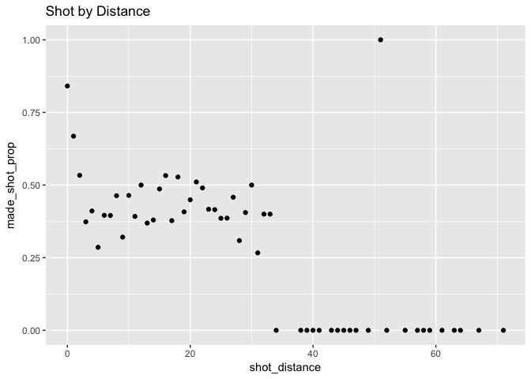
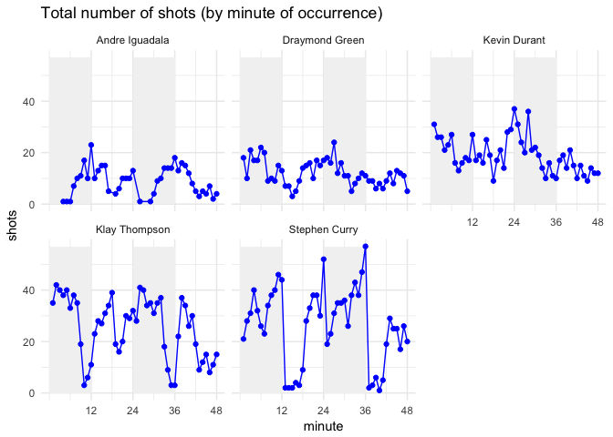

HW02 - Shot Charts
================
Kanak Garg
3/5/2018

``` r
library(dplyr)
```

    ## 
    ## Attaching package: 'dplyr'

    ## The following objects are masked from 'package:stats':
    ## 
    ##     filter, lag

    ## The following objects are masked from 'package:base':
    ## 
    ##     intersect, setdiff, setequal, union

``` r
library(ggplot2)
shot_data <- read.csv(file = "../data/shot-data.csv", stringsAsFactors = FALSE)
```

Total Shots By Player
=====================

``` r
dat1 <- 
shot_data %>%
  group_by(name) %>%
  select(name) %>%
  summarise(total = length(name)) %>%
  arrange(desc(total))
dat1
```

    ## # A tibble: 5 x 2
    ##   name           total
    ##   <chr>          <int>
    ## 1 Stephen Curry   1250
    ## 2 Klay Thompson   1220
    ## 3 Kevin Durant     915
    ## 4 Draymond Green   578
    ## 5 Andre Iguadala   371

``` r
dat2 <- 
shot_data %>%
  group_by(name) %>%
  select(name, shot_type, shot_made_flag) %>%
  summarise(
    total = length(name),
    made = length(shot_made_flag[shot_made_flag == "made shot"]),
    perc_made = made/total) %>%
  arrange(desc(total))
dat2
```

    ## # A tibble: 5 x 4
    ##   name           total  made perc_made
    ##   <chr>          <int> <int>     <dbl>
    ## 1 Stephen Curry   1250   584     0.467
    ## 2 Klay Thompson   1220   575     0.471
    ## 3 Kevin Durant     915   495     0.541
    ## 4 Draymond Green   578   245     0.424
    ## 5 Andre Iguadala   371   192     0.518

``` r
dat3 <- 
shot_data %>%
  group_by(name) %>%
  select(name, shot_type, shot_made_flag) %>%
  summarise(
    total2pt = length(shot_type[shot_type=="2PT Field Goal"]),
    made2pt = length(shot_made_flag[shot_made_flag == "made shot" & shot_type == "2PT Field Goal"]),
    perc2pt = made2pt/total2pt) %>%
  arrange(desc(total2pt))
dat3
```

    ## # A tibble: 5 x 4
    ##   name           total2pt made2pt perc2pt
    ##   <chr>             <int>   <int>   <dbl>
    ## 1 Kevin Durant        643     390   0.607
    ## 2 Klay Thompson       640     329   0.514
    ## 3 Stephen Curry       563     304   0.540
    ## 4 Draymond Green      346     171   0.494
    ## 5 Andre Iguadala      210     134   0.638

``` r
dat4 <- 
shot_data %>%
  group_by(name) %>%
  select(name, shot_type, shot_made_flag) %>%
  summarise(
    total3pt = length(shot_type[shot_type=="3PT Field Goal"]),
    made3pt = length(shot_made_flag[shot_made_flag == "made shot" & shot_type == "3PT Field Goal"]),
    perc3pt = made3pt/total3pt) %>%
  arrange(desc(total3pt))
dat4
```

    ## # A tibble: 5 x 4
    ##   name           total3pt made3pt perc3pt
    ##   <chr>             <int>   <int>   <dbl>
    ## 1 Stephen Curry       687     280   0.408
    ## 2 Klay Thompson       580     246   0.424
    ## 3 Kevin Durant        272     105   0.386
    ## 4 Draymond Green      232      74   0.319
    ## 5 Andre Iguadala      161      58   0.360

``` r
dat5 <- 
shot_data %>%
  group_by(shot_distance) %>%
  select(shot_distance, shot_made_flag) %>%
  summarise(
    made_shot_prop = length(shot_made_flag[shot_made_flag == "made shot"])/n()) %>%
  arrange(shot_distance)
dat5
```

    ## # A tibble: 56 x 2
    ##    shot_distance made_shot_prop
    ##            <int>          <dbl>
    ##  1             0          0.841
    ##  2             1          0.668
    ##  3             2          0.534
    ##  4             3          0.373
    ##  5             4          0.411
    ##  6             5          0.286
    ##  7             6          0.396
    ##  8             7          0.395
    ##  9             8          0.463
    ## 10             9          0.321
    ## # ... with 46 more rows

``` r
ggplot(data = dat5) + geom_point(aes(x = shot_distance, y = made_shot_prop)) +
  ggtitle('Shot by Distance') 
```



-   What do you observe?
    There is a definite correlation between shot distance and the the proportion of shots made. As the distance increases, shot proportion follows a downward trend. There is an outlier at 51 shot distance.

-   Can you confirm that the shorter the distance, the more effective the shots?
    No, as distance decreases, the shot proportion made does not necessarily increase. There are instances where shot proportion decreases as distnace decrases.

-   Can you guesstimate a distance threshold beyond which the chance of making a successful shot is basically null?
    After 34, the shot chances are basically null.

-   What distances tend to have a percentage (of making a shot) of 50% or more?
    Distances around 0, 1, 2, 12, 16, 18, 21, 30 and 51 tend to have a shot percentage of 50% or more.

``` r
dat6 <- 
shot_data %>%
  group_by(name, minute, period) %>%
  select(name, minute, period) %>%
  summarise(
    shots = length(minute))
dat6
```

    ## # A tibble: 233 x 4
    ## # Groups:   name, minute [?]
    ##    name           minute period shots
    ##    <chr>           <int>  <int> <int>
    ##  1 Andre Iguadala      4      1     1
    ##  2 Andre Iguadala      5      1     1
    ##  3 Andre Iguadala      6      1     1
    ##  4 Andre Iguadala      7      1     7
    ##  5 Andre Iguadala      8      1    10
    ##  6 Andre Iguadala      9      1    11
    ##  7 Andre Iguadala     10      1    17
    ##  8 Andre Iguadala     11      1    10
    ##  9 Andre Iguadala     12      1    23
    ## 10 Andre Iguadala     13      2    10
    ## # ... with 223 more rows

``` r
ggplot(data = dat6) + aes(x = minute, y = shots, xmin = (period%%2)*24, xmax = (period%%2)*24 +12 , ymin = 0, ymax = max(shots)) + geom_rect(fill = "grey95") + geom_point( col = "blue" ) +
  scale_x_continuous(breaks = c(12,24,36,48)) + geom_path(col = "blue") + 
  ggtitle('Total number of shots (by minute of occurrence)') +theme_minimal() + facet_wrap(~ name)
```


