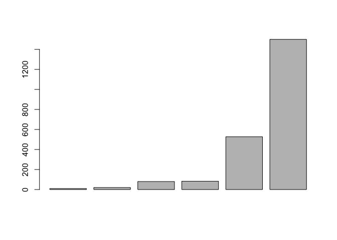

Lab 1: Getting started with R and RStudio
================
Kanak Garg

R as a scientific calculator
----------------------------

``` r
# total expenses
80 + 20 + 527 + 10 + 1500 + 83
```

    ## [1] 2220

``` r
phone <- 80
transportation <- 20
groceries <- 527
gym <-  10
rent <- 1500
other <- 83
total <- phone + transportation + groceries + gym + rent + other 
```

Assuming that Leia has the same expenses every month, how much would she spend during a school "semester"? (assume the semester involves five months)

``` r
# semester expenses
semExp = 5*total
semExp
```

    ## [1] 11100

Maintaining the same assumption about the monthly expenses, how much would Leia spend during a school "year"? (assume the academic year is 10 months)

``` r
# year expenses
yearExp = 10*total
yearExp
```

    ## [1] 22200

### Case Sensitive

R is case sensitive. This means that `phone` is not the same as `Phone` or `PHONE`

``` r
# case sensitive
phone <- 80
Phone <- -80
PHONE <- 8000

phone + Phone
```

    ## [1] 0

``` r
PHONE - phone
```

    ## [1] 7920

### Your turn

Take your objects (i.e. variables) `phone`, `transportation`, `groceries`, `gym`, `rent`, and `other` and pass them inside the *combine* function `c()` to create a vector `expenses`

``` r
# your vector expenses
expenses <- c(phone, transportation, groceries, gym, rent, other)
```

Now, use the graphing function `barplot()` to produce a barchart of `expenses`:

``` r
barplot(expenses)
```

``` r
sortedExpenses = sort(expenses)
barplot(sortedExpenses)
```



Your Turn
---------

Calculate the hypotenuse of a right triangle with legs of length 3 and 4. Use the `sqrt()` function, and create variables `a = 3` and `b = 4`.

``` r
a = 3
b = 4
c = sqrt(a*a + b*b)
c
```

    ## [1] 5

### Binomial Formula

For instance, the number of combinations in which *k* = 2 success can occur in *n* = 5 trials is:

``` r
choose(n = 5, k = 2)
```

    ## [1] 10

Conveniently, R also provides the function `factorial()` to calculate the factorial of an integer:

``` r
factorial(4)
```

    ## [1] 24

Let's consider a simple example. A fair coin is tossed 5 times. What is the probability of getting exactly 2 heads?

``` r
n = 5
k =2
p = 0.5
factorial(n)/(factorial(k)*factorial(n-k))
```

    ## [1] 10

``` r
choose(n = 5, k = 2)
```

    ## [1] 10

``` r
choose(n = 5, k = 2)*p^2*p^3
```

    ## [1] 0.3125

-   Consider rolling a fair die 10 times. What is the probability of getting exactly 3 sixes?

``` r
p = 1/6
choose(n = 10, k = 3)*(p^3)*((1-p)^7)
```

    ## [1] 0.1550454

Obtain the above probabilities: 2 heads in 5 coin tosses, and 3 sixes in 3 rolls of a die.

``` r
dbinom(2, 5, 0.5) * dbinom(3,6, 1/6)
```

    ## [1] 0.0167449

-   How would you modify the previous binomial function to calculate the same probability (2 heads in 5 tosses) of a **biased** coin with a chance of heads of 35%?

``` r
dbinom(2, 5, 0.35)
```

    ## [1] 0.3364156

-   Finally, obtain the probability of getting more than 3 heads in 5 tosses with a biased coin of 35% chance of heads.

``` r
sum(dbinom(4:5, 5, 0.35))
```

    ## [1] 0.0540225

### Your turn

-   Calculate: 3*x*<sup>2</sup> + 4*x* + 8 when *x* = 2

``` r
x <- 2
3*x^2 + 4*x + 8
```

    ## [1] 28

-   Calculate: 3*x*<sup>2</sup> + 4*x* + 8 but now with a numeric sequence for *x* using `x <- -3:3`

``` r
x <- -3:3
3*x^2 + 4*x + 8
```

    ## [1] 23 12  7  8 15 28 47

Find what does the tab **Files** is good for? Files allows you to look through folders and files on your computer.

What about the tab **Help**? Help allows you to search up and look at functions that you can use.

In the tab **Help**, what happens when you click the button with a House icon? Return to the homepage of where you can get help for a variety of things.

Now go to the tab **History**. What is it good for? and what about the buttons of its associated menu bar? History shows previous entered lines in the console. The buttons allow you to save commands, import commands, move lines to console and move lines to a source.

Likewise, what can you say about the tab **Environment**? Environment tab allows you to see variables in different frames and their current values.

Review Questions
----------------

    # example 1
    var<-3
    Var*2
    Error, R is case sensitive.

    # example 2
    x<-2
    2x<-2*x
    Error, variables cannot start with numbers.

    # example 3
    sqrt4 <- sqrt(4)
    sqrt4
    2

    # example 4
    a number <- 16
    Error, no spaces in variable names

    # example 5
    "one number" <- 16
    `one number`
    16
    one number
    Error, incorrect variable name.
