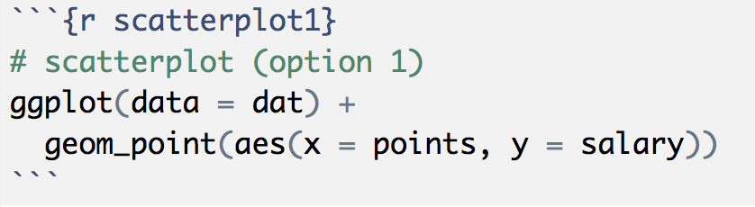

<<<<<<< HEAD
```{r}
=======
- [dplyr cheatsheet](../cheatsheets/data-transformation-cheatsheet.pdf)
- [ggplot2 cheatsheet](../cheatsheets/ggplot2-cheatsheet-2.1.pdf)

-----

## Filestructure and Shell Commands

We want you to keep practicing with the command line (e.g. Mac Terminal, Gitbash). Follow the steps listed below to create the 
necessary subdirectories like those depicted in this scheme:

```
    lab05/
      README.md
      data/
        nba2017-players.csv
      report/
        lab05.Rmd
        lab05.html
      images/
        ... # all the plot files
```

- Open a command line interface (e.g. Terminal or GitBash)
- Change your working directory to a location where you will store all the 
materials for this lab
- Use `mkdir` to create a directory `lab05` for the lab materials
- Use `cd` to change directory to (i.e. move inside) `lab05`
- Create other subdirectories: `data`, `report`, `images`
- Use `ls` to list the contents of `lab05` and confirm that you have all the subdirectories.
- Use `touch` to create an empty `README.md` text file
- Use a text editor (e.g. the one in RStudio) to open the `README.md` file, and then add a brief description of today's lab, using markdown syntax.
- Change directory to the `data/` folder.
- Download the data file with the command `curl`, and the `-O` option (letter O)
```bash
curl -O https://raw.githubusercontent.com/ucb-stat133/stat133-spring-2018/master/data/nba2017-players.csv
```
- Use `ls` to confirm that the csv file is in `data/`
- Use _word count_ `wc` to count the lines of the csv file
- Take a peek at the first rows of the csv file with `head`
- Take a peek at the last 5 rows of the csv file with `tail`

-----


### Installing packages

I'm assuming that you already installed the packages `"dplyr"` and `"ggplot2"`. 
If that's not the case then run on the console the command below 
(do NOT include this command in your `Rmd`):

```r
# don't include this command in your Rmd file
# don't worry too much if you get a warning message
install.packages(c("dplyr", "ggplot2"))
```

Remember that you only need to install a package once! After a package has been 
installed in your machine, there is no need to call `install.packages()` again 
on the same package. What you should always invoke in order to use the 
functions in a package is the `library()` function:
>>>>>>> e346e1158e88e406ac3b2748effa98e911d1bd52

library(dplyr)
library(ggplot2)
library(readr)
```

<<<<<<< HEAD
=======
__About loading packages:__ Another rule to keep in mind is to always load any 
required packages at the very top of your script files (`.R` or `.Rmd` or `.Rnw` files). 
Avoid calling the `library()` function in the middle of a script. Instead, 
load all the packages before anything else.


### Path for Images

The other important specification to include in your Rmd file is a global 
chunk option to specify the location of plots and graphics. This is done by 
setting the `fig.path` argument inside the `knitr::opts_chunk$set()` function.


If you don't specify `fig.path`, `"knitr"` will create a default directory to store
all the plots produced when knitting an Rmd file. This time, however, we want 
to have more control over where things are placed. Because you already have a 
folder `images/` as part of the filestructure, this is where we want `"knitr"` 
to save all the generated graphics.

Notice the use of a relative path `fig.path = '../images/'`. This is because
your Rmd file should be inside the folder `report/`, but the folder `images/`
is outside `report/` (i.e. in the same parent directory of `report/`).

-----
>>>>>>> e346e1158e88e406ac3b2748effa98e911d1bd52

## NBA Players Data

```{r nba, echo = FALSE}
dat <- read.csv('../data/nba2017-players.csv', stringsAsFactors = FALSE)
```

<<<<<<< HEAD
=======
The data file for this lab is the same you used last week: `nba2017-players.csv`.
>>>>>>> e346e1158e88e406ac3b2748effa98e911d1bd52

To import the data in R you can use the base function `read.csv()`, or you 
can also use `read_csv()` from the package `"readr"`:

```{r read, eval = FALSE}
# with "base" read.csv()
dat <- read.csv('nba2017-players.csv', stringsAsFactors = FALSE)

# with "readr" read_csv()
dat <- read_csv('nba2017-players.csv')
```


-----

## Basic `"dplyr"` verbs

To make the learning process of `"dplyr"` gentler, Hadley Wickham proposes 
beginning with a set of five _basic verbs_ or operations for data frames 
(each verb corresponds to a function in `"dplyr"`):

- __filter__: keep rows matching criteria
- __select__: pick columns by name
- __mutate__: add new variables
- __arrange__: reorder rows
- __summarise__: reduce variables to values

I've slightly modified Hadley's list of verbs: 

- `filter()`, `slice()`, and `select()`: subsetting and selecting rows and columns
- `mutate()`: add new variables
- `arrange()`: reorder rows
- `summarise()`: reduce variables to values
- `group_by()`: grouped (aggregate) operations

-----


### Your turn:

- use `slice()` to subset the data by selecting the first 5 rows.
```{r}
fiveR <- dplyr::slice(dat, 1:5)

```

- use `slice()` to subset the data by selecting rows 10, 15, 20, ..., 50.

```{r}
fifth <- slice(dat, 5*c(2:10))
```


- use `filter()` to subset those players with height less than 70 inches tall.

```{r}
LT70 <- filter(dat, height <= 70)
```


- find how to select the name, age, and team, of players with more than 
10 years of experience, making 10 million dollars or less.
```{r}
select(filter(dat, experience > 10 & salary < 10000000), c(player, age, team))
```


### Your Turn

- use the original data frame to `filter()` and `arrange()` those players with height less than 71 inches tall, in increasing order.

```{r}
arrange(LT70, height)
```


- create a data frame `gsw_mpg` of GSW players, that contains variables for 
player name, experience, and `min_per_game` (minutes per game), sorted by `min_per_game` (in descending order)
```{r}
gsw_mpg <- arrange(select(filter(mutate(dat, mpg = minutes/games), team == "GSW"), c(player, experience, mpg)), mpg)
gsw_mpg
```


- obtain the mean and standard deviation of `age`, for Power Forwards, with 5 
and 10 years (including) years of experience.

<<<<<<< HEAD
=======

-----


# First contact with `ggplot()`

The package `"ggplot2"` is probably the most popular package in R to create
_beautiful_ static graphics. Comapred to the functions in the base package 
`"graphcics"`, the package `"ggplot2`" follows a somewhat different philosophy, 
and it tries to be more consistent and modular as possible.

- The main function in `"ggplot2"` is `ggplot()`
- The main input to `ggplot()` is a data frame object.
- You can use the internal function `aes()` to specify what columns of the data 
frame will be used for the graphical elements of the plot.
- You must specify what kind of _geometric objects_ or __geoms__ will be
displayed: e.g. `geom_point()`, `geom_bar()`, `geom_boxpot()`.
- Pretty much anything else that you want to add to your plot is controlled 
by auxiliary functions, especially those things that have to do with the format,
rather than the underlying data.
- The construction of a ggplot is done by _adding layers_ with the `+` operator.


### Scatterplots

Let's start with a scatterplot of `salary` and `points`

```{r}
# scatterplot (option 1)
ggplot(data = dat) +
  geom_point(aes(x = points, y = salary))
```

- `ggplot()` creates an object of class `"ggplot"`
- the main input for `ggplot()` is `data` which must be a data frame
- then we use the `"+"` operator to add a layer
- the geometric object (geom) are points: `geom_points()`
- `aes()` is used to specify the `x` and `y` coordinates, by taking columns
`points` and `salary` from the data frame

The same scatterplot can also be created with this alternative, and more 
common use of `ggplot()`

```{r eval = FALSE}
# scatterplot (option 2)
ggplot(data = dat, aes(x = points, y = salary)) +
  geom_point()
```


### Label your chunks!

When including code for plots and graphics, we strongly recommend that you create an
individual code chunk for each plot, and that you __give a label__ to that chunk.
This is illustrated in the following screenshot. 



Note that the code chunk has
a label `scatterplot1`; moreover, the code is exclusively decidated to this
plot. Why should you care? Because when `"knitr"` creates the file of the plot, 
it will use the chunk label for the graph. So it's better to give meaningful
names to those chunks containing graphics.


### Adding color

Say you want to color code the points in terms of `position`

```{r}
# colored scatterplot 
ggplot(data = dat, aes(x = points, y = salary)) +
  geom_point(aes(color = position))
```

Maybe you wan to modify the size of the dots in terms of `points3`:

>>>>>>> e346e1158e88e406ac3b2748effa98e911d1bd52
```{r}
summarise(filter(dat, position == "PF" & experience > 5 & experience < 10), mean = mean(age), sd = sd(age))
```

### Your turn:


- Make a scatterplot of `experience` and `salary` for the Warriors, but this time add a layer with `theme_bw()` to get a simpler background
```{r}
gsw <- filter(dat, team == "GSW")

ggplot(data = gsw, (aes(x = experience, y = salary))) + geom_point()
theme_dark(base_size = 11, base_family = "")
```

<<<<<<< HEAD
=======
### Your turn:

- Make scatterplots of `experience` and `salary` faceting by `position`
- Make scatterplots of `experience` and `salary` faceting by `team`
- Make density plots of `age` faceting by `team`
- Make scatterplots of `height` and `weight` faceting by `position`
- Make scatterplots of `height` and `weight`, with a 2-dimensional density, 
`geom_density2d()`, faceting by `position`
- Make a scatterplot of `experience` and `salary` for the Warriors, but this time add a layer with `theme_bw()` to get a simpler background
- Repeat any of the previous plots but now adding a leyer with another 
theme e.g. `theme_minimal()`, `theme_dark()`, `theme_classic()`


-----

## More shell commands

Now that you have a bunch of images inside the `images/` subdirectory, let's 
keep practicing some basic commands.

- Open the terminal.
- Move inside the `images/` directory of the lab.
- List the contents of this directory.
- Now list the contents of the directory in _long format_.
- How would you list the contents in long format, by time?
- How would you list the contents displaying the results in reverse (alphabetical)? order
- Without changing your current directory, create a directory `copies` at the
parent level (i.e. `lab05/`).
- Copy one of the PNG files to the `copies` folder.
- Use the wildcard `*` to copy all the `.png` files in the directory `copies`.
- Change to the directory `copies`.
- Use the command `mv` to rename some of your PNG files.
- Change to the `report/` directory.
- From within `report/`, find out how to rename the directory `copies` as `copy-files`.
- From within `report/`, delete one or two PNG files in `copy-files`.
- From within `report/`, find out how to delete the directory `copy-files`.


>>>>>>> e346e1158e88e406ac3b2748effa98e911d1bd52
