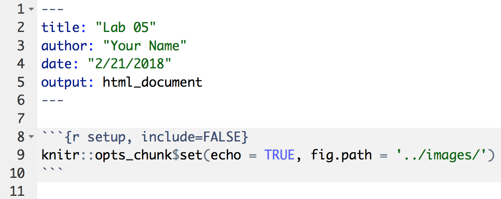
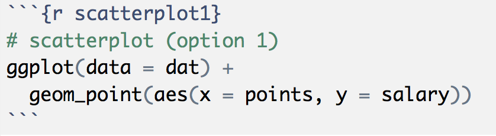
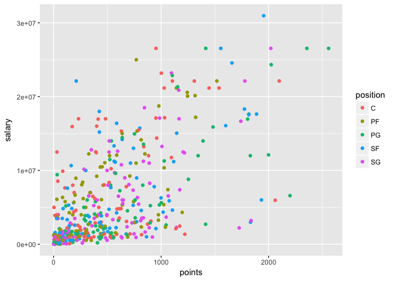
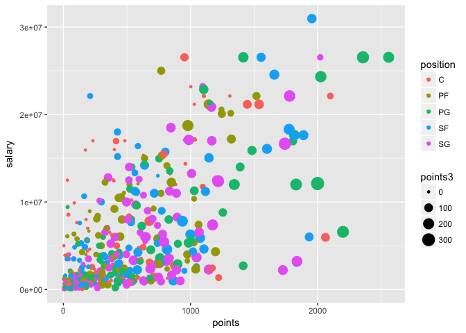
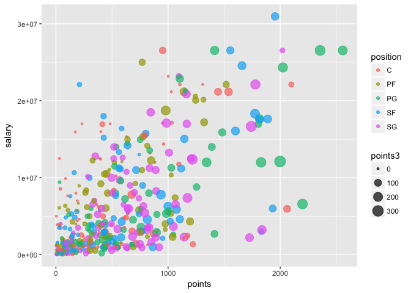
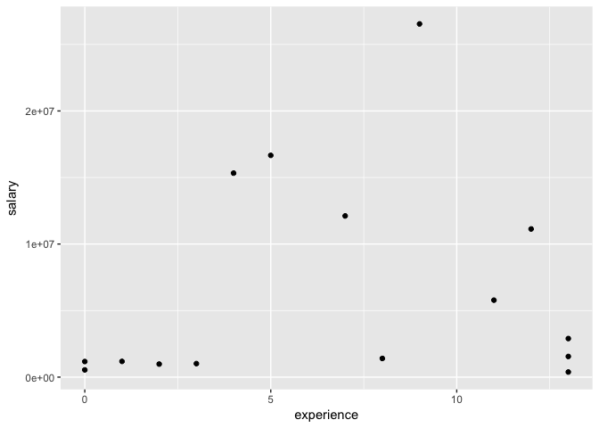
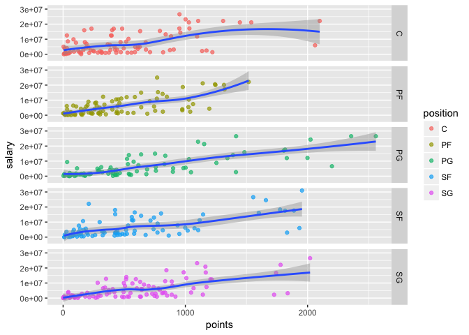

Lab 5: First contact with dplyr and ggplot2
================
<<<<<<< HEAD
Kanak Garg
=======
Gaston Sanchez

> ### Learning Objectives:
>
> -   Get started with `"dplyr"`
> -   Get to know the basic dplyr verbs:
> -   `slice()`, `filter()`, `select()`
> -   `mutate()`
> -   `arrange()`
> -   `summarise()`
> -   `group_by()`
> -   Get started with `"ggplot2"`
> -   Produce basic plots with `ggplot()`

------------------------------------------------------------------------

Manipulating and Visualizing Data Frames
----------------------------------------

Last week you started to manipulate data tables (under the class of `"data.frame"` objects) using bracket notation, `dat[ , ]`, and the dollar operator, `dat$name`, in order to select specific rows, columns, or cells. In addition, you have been creating charts with functions like `plot()`, `boxplot()`, and `barplot()`, which are part of the `"graphics"` package.

In this lab, you will start learning about other approaches to manipulate tables and create statistical charts. We are going to use the functionality of the package `"dplyr"` to work with tabular data in a more consistent way. This is a fairly recent package introduced a couple of years ago, but it is based on more than a decade of research and work lead by Hadley Wickham.

Likewise, to create graphics in a more consistent and visually pleasing way, we are going to use the package `"ggplot2"`, also originally authored by Hadley Wickham, and developed as part of his PhD more than a decade ago.

Use the first hour of the lab to get as far as possible with the material associated to `"dplyr"`. Then use the second hour of the lab to work on graphics with `"ggplot2"`.

While you follow this lab, you may want to open these cheat sheets:

-   [dplyr cheatsheet](../cheatsheets/data-transformation-cheatsheet.pdf)
-   [ggplot2 cheatsheet](../cheatsheets/ggplot2-cheatsheet-2.1.pdf)

------------------------------------------------------------------------

Filestructure and Shell Commands
--------------------------------

We want you to keep practicing with the command line (e.g. Mac Terminal, Gitbash). Follow the steps listed below to create the necessary subdirectories like those depicted in this scheme:

        lab05/
          README.md
          data/
            nba2017-players.csv
          report/
            lab05.Rmd
            lab05.html
          images/
            ... # all the plot files

-   Open a command line interface (e.g. Terminal or GitBash)
-   Change your working directory to a location where you will store all the materials for this lab
-   Use `mkdir` to create a directory `lab05` for the lab materials
-   Use `cd` to change directory to (i.e. move inside) `lab05`
-   Create other subdirectories: `data`, `report`, `images`
-   Use `ls` to list the contents of `lab05` and confirm that you have all the subdirectories.
-   Use `touch` to create an empty `README.md` text file
-   Use a text editor (e.g. the one in RStudio) to open the `README.md` file, and then add a brief description of today's lab, using markdown syntax.
-   Change directory to the `data/` folder.
-   Download the data file with the command `curl`, and the `-O` option (letter O)

    ``` bash
    curl -O https://raw.githubusercontent.com/ucb-stat133/stat133-spring-2018/master/data/nba2017-players.csv
    ```

-   Use `ls` to confirm that the csv file is in `data/`
-   Use *word count* `wc` to count the lines of the csv file
-   Take a peek at the first rows of the csv file with `head`
-   Take a peek at the last 5 rows of the csv file with `tail`

------------------------------------------------------------------------

### Installing packages

I'm assuming that you already installed the packages `"dplyr"` and `"ggplot2"`. If that's not the case then run on the console the command below (do NOT include this command in your `Rmd`):
>>>>>>> e346e1158e88e406ac3b2748effa98e911d1bd52

``` r
library(dplyr)
```

    ## 
    ## Attaching package: 'dplyr'

    ## The following objects are masked from 'package:stats':
    ## 
    ##     filter, lag

    ## The following objects are masked from 'package:base':
    ## 
    ##     intersect, setdiff, setequal, union

``` r
library(ggplot2)
library(readr)
```

<<<<<<< HEAD
NBA Players Data
----------------

=======
**About loading packages:** Another rule to keep in mind is to always load any required packages at the very top of your script files (`.R` or `.Rmd` or `.Rnw` files). Avoid calling the `library()` function in the middle of a script. Instead, load all the packages before anything else.

### Path for Images

The other important specification to include in your Rmd file is a global chunk option to specify the location of plots and graphics. This is done by setting the `fig.path` argument inside the `knitr::opts_chunk$set()` function.



If you don't specify `fig.path`, `"knitr"` will create a default directory to store all the plots produced when knitting an Rmd file. This time, however, we want to have more control over where things are placed. Because you already have a folder `images/` as part of the filestructure, this is where we want `"knitr"` to save all the generated graphics.

Notice the use of a relative path `fig.path = '../images/'`. This is because your Rmd file should be inside the folder `report/`, but the folder `images/` is outside `report/` (i.e. in the same parent directory of `report/`).

------------------------------------------------------------------------

NBA Players Data
----------------

The data file for this lab is the same you used last week: `nba2017-players.csv`.

>>>>>>> e346e1158e88e406ac3b2748effa98e911d1bd52
To import the data in R you can use the base function `read.csv()`, or you can also use `read_csv()` from the package `"readr"`:

``` r
# with "base" read.csv()
dat <- read.csv('nba2017-players.csv', stringsAsFactors = FALSE)

# with "readr" read_csv()
dat <- read_csv('nba2017-players.csv')
```

------------------------------------------------------------------------

Basic `"dplyr"` verbs
---------------------

To make the learning process of `"dplyr"` gentler, Hadley Wickham proposes beginning with a set of five *basic verbs* or operations for data frames (each verb corresponds to a function in `"dplyr"`):

-   **filter**: keep rows matching criteria
-   **select**: pick columns by name
-   **mutate**: add new variables
-   **arrange**: reorder rows
-   **summarise**: reduce variables to values

I've slightly modified Hadley's list of verbs:

-   `filter()`, `slice()`, and `select()`: subsetting and selecting rows and columns
-   `mutate()`: add new variables
-   `arrange()`: reorder rows
-   `summarise()`: reduce variables to values
-   `group_by()`: grouped (aggregate) operations

------------------------------------------------------------------------

### Your turn:

-   use `slice()` to subset the data by selecting the first 5 rows.

``` r
fiveR <- dplyr::slice(dat, 1:5)
```

-   use `slice()` to subset the data by selecting rows 10, 15, 20, ..., 50.

``` r
fifth <- slice(dat, 5*c(2:10))
```

-   use `filter()` to subset those players with height less than 70 inches tall.

``` r
LT70 <- filter(dat, height <= 70)
```

-   find how to select the name, age, and team, of players with more than 10 years of experience, making 10 million dollars or less.

``` r
select(filter(dat, experience > 10 & salary < 10000000), c(player, age, team))
```

    ##               player age team
    ## 1      Dahntay Jones  36  CLE
    ## 2     Deron Williams  32  CLE
    ## 3        James Jones  36  CLE
    ## 4        Kyle Korver  35  CLE
    ## 5  Richard Jefferson  36  CLE
    ## 6      Jose Calderon  35  ATL
    ## 7     Kris Humphries  31  ATL
    ## 8      Mike Dunleavy  36  ATL
    ## 9        Jason Terry  39  MIL
    ## 10        C.J. Miles  29  IND
    ## 11     Udonis Haslem  36  MIA
    ## 12        Beno Udrih  34  DET
    ## 13        David West  36  GSW
    ## 14       Matt Barnes  36  GSW
    ## 15  Shaun Livingston  31  GSW
    ## 16     Zaza Pachulia  32  GSW
    ## 17         David Lee  33  SAS
    ## 18      Lou Williams  30  HOU
    ## 19      Trevor Ariza  31  HOU
    ## 20      Brandon Bass  31  LAC
    ## 21       Paul Pierce  39  LAC
    ## 22    Raymond Felton  32  LAC
    ## 23        Boris Diaw  34  UTA
    ## 24     Nick Collison  36  OKC
    ## 25        Tony Allen  35  MEM
    ## 26      Vince Carter  40  MEM
    ## 27     Jameer Nelson  34  DEN
    ## 28       Mike Miller  36  DEN
    ## 29      Devin Harris  33  DAL
    ## 30 Metta World Peace  37  LAL
    ## 31   Leandro Barbosa  34  PHO
    ## 32      Ronnie Price  33  PHO

### Your Turn

-   use the original data frame to `filter()` and `arrange()` those players with height less than 71 inches tall, in increasing order.

``` r
arrange(LT70, height)
```

    ##          player team position height weight age experience
    ## 1 Isaiah Thomas  BOS       PG     69    185  27          5
    ## 2    Kay Felder  CLE       PG     69    176  21          0
    ## 3    Tyler Ulis  PHO       PG     70    150  21          0
    ##                    college  salary games minutes points points3 points2
    ## 1 University of Washington 6587132    76    2569   2199     245     437
    ## 2       Oakland University  543471    42     386    166       7      55
    ## 3   University of Kentucky  918369    61    1123    444      21     163
    ##   points1
    ## 1     590
    ## 2      35
    ## 3      55

-   create a data frame `gsw_mpg` of GSW players, that contains variables for player name, experience, and `min_per_game` (minutes per game), sorted by `min_per_game` (in descending order)

``` r
gsw_mpg <- arrange(select(filter(mutate(dat, mpg = minutes/games), team == "GSW"), c(player, experience, mpg)), mpg)
gsw_mpg
```

    ##                  player experience       mpg
    ## 1          Kevon Looney          1  8.433962
    ## 2          Damian Jones          0  8.500000
    ## 3  James Michael McAdoo          2  8.788462
    ## 4          JaVale McGee          8  9.597403
    ## 5            David West         13 12.558824
    ## 6             Ian Clark          3 14.766234
    ## 7         Patrick McCaw          0 15.126761
    ## 8      Shaun Livingston         11 17.697368
    ## 9         Zaza Pachulia         13 18.114286
    ## 10          Matt Barnes         13 20.500000
    ## 11       Andre Iguodala         12 26.289474
    ## 12       Draymond Green          4 32.513158
    ## 13         Kevin Durant          9 33.387097
    ## 14        Stephen Curry          7 33.392405
    ## 15        Klay Thompson          5 33.961538

-   obtain the mean and standard deviation of `age`, for Power Forwards, with 5 and 10 years (including) years of experience.

``` r
summarise(filter(dat, position == "PF" & experience > 5 & experience < 10), mean = mean(age), sd = sd(age))
```

<<<<<<< HEAD
    ##       mean       sd
    ## 1 28.40909 1.501082
=======
### Label your chunks!

When including code for plots and graphics, we strongly recommend that you create an individual code chunk for each plot, and that you **give a label** to that chunk. This is illustrated in the following screenshot.



Note that the code chunk has a label `scatterplot1`; moreover, the code is exclusively decidated to this plot. Why should you care? Because when `"knitr"` creates the file of the plot, it will use the chunk label for the graph. So it's better to give meaningful names to those chunks containing graphics.

### Adding color

Say you want to color code the points in terms of `position`

``` r
# colored scatterplot 
ggplot(data = dat, aes(x = points, y = salary)) +
  geom_point(aes(color = position))
```



Maybe you wan to modify the size of the dots in terms of `points3`:

``` r
# sized and colored scatterplot 
ggplot(data = dat, aes(x = points, y = salary)) +
  geom_point(aes(color = position, size = points3))
```



To add some transparency effect to the dots, you can use the `alpha` parameter.

``` r
# sized and colored scatterplot 
ggplot(data = dat, aes(x = points, y = salary)) +
  geom_point(aes(color = position, size = points3), alpha = 0.7)
```



Notice that `alpha` was specified outside `aes()`. This is because we are not using any column for the `alpha` transparency values.
>>>>>>> e346e1158e88e406ac3b2748effa98e911d1bd52

### Your turn:

-   Make a scatterplot of `experience` and `salary` for the Warriors, but this time add a layer with `theme_bw()` to get a simpler background

``` r
gsw <- filter(dat, team == "GSW")

ggplot(data = gsw, (aes(x = experience, y = salary))) + geom_point()
```



``` r
theme_dark(base_size = 11, base_family = "")
```

<<<<<<< HEAD
    ## List of 57
    ##  $ line                 :List of 6
    ##   ..$ colour       : chr "black"
    ##   ..$ size         : num 0.5
    ##   ..$ linetype     : num 1
    ##   ..$ lineend      : chr "butt"
    ##   ..$ arrow        : logi FALSE
    ##   ..$ inherit.blank: logi TRUE
    ##   ..- attr(*, "class")= chr [1:2] "element_line" "element"
    ##  $ rect                 :List of 5
    ##   ..$ fill         : chr "white"
    ##   ..$ colour       : chr "black"
    ##   ..$ size         : num 0.5
    ##   ..$ linetype     : num 1
    ##   ..$ inherit.blank: logi TRUE
    ##   ..- attr(*, "class")= chr [1:2] "element_rect" "element"
    ##  $ text                 :List of 11
    ##   ..$ family       : chr ""
    ##   ..$ face         : chr "plain"
    ##   ..$ colour       : chr "black"
    ##   ..$ size         : num 11
    ##   ..$ hjust        : num 0.5
    ##   ..$ vjust        : num 0.5
    ##   ..$ angle        : num 0
    ##   ..$ lineheight   : num 0.9
    ##   ..$ margin       :Classes 'margin', 'unit'  atomic [1:4] 0 0 0 0
    ##   .. .. ..- attr(*, "valid.unit")= int 8
    ##   .. .. ..- attr(*, "unit")= chr "pt"
    ##   ..$ debug        : logi FALSE
    ##   ..$ inherit.blank: logi TRUE
    ##   ..- attr(*, "class")= chr [1:2] "element_text" "element"
    ##  $ axis.title.x         :List of 11
    ##   ..$ family       : NULL
    ##   ..$ face         : NULL
    ##   ..$ colour       : NULL
    ##   ..$ size         : NULL
    ##   ..$ hjust        : NULL
    ##   ..$ vjust        : num 1
    ##   ..$ angle        : NULL
    ##   ..$ lineheight   : NULL
    ##   ..$ margin       :Classes 'margin', 'unit'  atomic [1:4] 5.5 0 0 0
    ##   .. .. ..- attr(*, "valid.unit")= int 8
    ##   .. .. ..- attr(*, "unit")= chr "pt"
    ##   ..$ debug        : NULL
    ##   ..$ inherit.blank: logi TRUE
    ##   ..- attr(*, "class")= chr [1:2] "element_text" "element"
    ##  $ axis.title.x.top     :List of 11
    ##   ..$ family       : NULL
    ##   ..$ face         : NULL
    ##   ..$ colour       : NULL
    ##   ..$ size         : NULL
    ##   ..$ hjust        : NULL
    ##   ..$ vjust        : num 0
    ##   ..$ angle        : NULL
    ##   ..$ lineheight   : NULL
    ##   ..$ margin       :Classes 'margin', 'unit'  atomic [1:4] 0 0 5.5 0
    ##   .. .. ..- attr(*, "valid.unit")= int 8
    ##   .. .. ..- attr(*, "unit")= chr "pt"
    ##   ..$ debug        : NULL
    ##   ..$ inherit.blank: logi TRUE
    ##   ..- attr(*, "class")= chr [1:2] "element_text" "element"
    ##  $ axis.title.y         :List of 11
    ##   ..$ family       : NULL
    ##   ..$ face         : NULL
    ##   ..$ colour       : NULL
    ##   ..$ size         : NULL
    ##   ..$ hjust        : NULL
    ##   ..$ vjust        : num 1
    ##   ..$ angle        : num 90
    ##   ..$ lineheight   : NULL
    ##   ..$ margin       :Classes 'margin', 'unit'  atomic [1:4] 0 5.5 0 0
    ##   .. .. ..- attr(*, "valid.unit")= int 8
    ##   .. .. ..- attr(*, "unit")= chr "pt"
    ##   ..$ debug        : NULL
    ##   ..$ inherit.blank: logi TRUE
    ##   ..- attr(*, "class")= chr [1:2] "element_text" "element"
    ##  $ axis.title.y.right   :List of 11
    ##   ..$ family       : NULL
    ##   ..$ face         : NULL
    ##   ..$ colour       : NULL
    ##   ..$ size         : NULL
    ##   ..$ hjust        : NULL
    ##   ..$ vjust        : num 0
    ##   ..$ angle        : num -90
    ##   ..$ lineheight   : NULL
    ##   ..$ margin       :Classes 'margin', 'unit'  atomic [1:4] 0 0 0 5.5
    ##   .. .. ..- attr(*, "valid.unit")= int 8
    ##   .. .. ..- attr(*, "unit")= chr "pt"
    ##   ..$ debug        : NULL
    ##   ..$ inherit.blank: logi TRUE
    ##   ..- attr(*, "class")= chr [1:2] "element_text" "element"
    ##  $ axis.text            :List of 11
    ##   ..$ family       : NULL
    ##   ..$ face         : NULL
    ##   ..$ colour       : chr "grey30"
    ##   ..$ size         :Class 'rel'  num 0.8
    ##   ..$ hjust        : NULL
    ##   ..$ vjust        : NULL
    ##   ..$ angle        : NULL
    ##   ..$ lineheight   : NULL
    ##   ..$ margin       : NULL
    ##   ..$ debug        : NULL
    ##   ..$ inherit.blank: logi TRUE
    ##   ..- attr(*, "class")= chr [1:2] "element_text" "element"
    ##  $ axis.text.x          :List of 11
    ##   ..$ family       : NULL
    ##   ..$ face         : NULL
    ##   ..$ colour       : NULL
    ##   ..$ size         : NULL
    ##   ..$ hjust        : NULL
    ##   ..$ vjust        : num 1
    ##   ..$ angle        : NULL
    ##   ..$ lineheight   : NULL
    ##   ..$ margin       :Classes 'margin', 'unit'  atomic [1:4] 2.2 0 0 0
    ##   .. .. ..- attr(*, "valid.unit")= int 8
    ##   .. .. ..- attr(*, "unit")= chr "pt"
    ##   ..$ debug        : NULL
    ##   ..$ inherit.blank: logi TRUE
    ##   ..- attr(*, "class")= chr [1:2] "element_text" "element"
    ##  $ axis.text.x.top      :List of 11
    ##   ..$ family       : NULL
    ##   ..$ face         : NULL
    ##   ..$ colour       : NULL
    ##   ..$ size         : NULL
    ##   ..$ hjust        : NULL
    ##   ..$ vjust        : num 0
    ##   ..$ angle        : NULL
    ##   ..$ lineheight   : NULL
    ##   ..$ margin       :Classes 'margin', 'unit'  atomic [1:4] 0 0 2.2 0
    ##   .. .. ..- attr(*, "valid.unit")= int 8
    ##   .. .. ..- attr(*, "unit")= chr "pt"
    ##   ..$ debug        : NULL
    ##   ..$ inherit.blank: logi TRUE
    ##   ..- attr(*, "class")= chr [1:2] "element_text" "element"
    ##  $ axis.text.y          :List of 11
    ##   ..$ family       : NULL
    ##   ..$ face         : NULL
    ##   ..$ colour       : NULL
    ##   ..$ size         : NULL
    ##   ..$ hjust        : num 1
    ##   ..$ vjust        : NULL
    ##   ..$ angle        : NULL
    ##   ..$ lineheight   : NULL
    ##   ..$ margin       :Classes 'margin', 'unit'  atomic [1:4] 0 2.2 0 0
    ##   .. .. ..- attr(*, "valid.unit")= int 8
    ##   .. .. ..- attr(*, "unit")= chr "pt"
    ##   ..$ debug        : NULL
    ##   ..$ inherit.blank: logi TRUE
    ##   ..- attr(*, "class")= chr [1:2] "element_text" "element"
    ##  $ axis.text.y.right    :List of 11
    ##   ..$ family       : NULL
    ##   ..$ face         : NULL
    ##   ..$ colour       : NULL
    ##   ..$ size         : NULL
    ##   ..$ hjust        : num 0
    ##   ..$ vjust        : NULL
    ##   ..$ angle        : NULL
    ##   ..$ lineheight   : NULL
    ##   ..$ margin       :Classes 'margin', 'unit'  atomic [1:4] 0 0 0 2.2
    ##   .. .. ..- attr(*, "valid.unit")= int 8
    ##   .. .. ..- attr(*, "unit")= chr "pt"
    ##   ..$ debug        : NULL
    ##   ..$ inherit.blank: logi TRUE
    ##   ..- attr(*, "class")= chr [1:2] "element_text" "element"
    ##  $ axis.ticks           :List of 6
    ##   ..$ colour       : chr "grey20"
    ##   ..$ size         : num 0.25
    ##   ..$ linetype     : NULL
    ##   ..$ lineend      : NULL
    ##   ..$ arrow        : logi FALSE
    ##   ..$ inherit.blank: logi TRUE
    ##   ..- attr(*, "class")= chr [1:2] "element_line" "element"
    ##  $ axis.ticks.length    :Class 'unit'  atomic [1:1] 2.75
    ##   .. ..- attr(*, "valid.unit")= int 8
    ##   .. ..- attr(*, "unit")= chr "pt"
    ##  $ axis.line            : list()
    ##   ..- attr(*, "class")= chr [1:2] "element_blank" "element"
    ##  $ axis.line.x          : NULL
    ##  $ axis.line.y          : NULL
    ##  $ legend.background    :List of 5
    ##   ..$ fill         : NULL
    ##   ..$ colour       : logi NA
    ##   ..$ size         : NULL
    ##   ..$ linetype     : NULL
    ##   ..$ inherit.blank: logi TRUE
    ##   ..- attr(*, "class")= chr [1:2] "element_rect" "element"
    ##  $ legend.margin        :Classes 'margin', 'unit'  atomic [1:4] 0.2 0.2 0.2 0.2
    ##   .. ..- attr(*, "valid.unit")= int 1
    ##   .. ..- attr(*, "unit")= chr "cm"
    ##  $ legend.spacing       :Class 'unit'  atomic [1:1] 0.4
    ##   .. ..- attr(*, "valid.unit")= int 1
    ##   .. ..- attr(*, "unit")= chr "cm"
    ##  $ legend.spacing.x     : NULL
    ##  $ legend.spacing.y     : NULL
    ##  $ legend.key           :List of 5
    ##   ..$ fill         : chr "grey50"
    ##   ..$ colour       : logi NA
    ##   ..$ size         : NULL
    ##   ..$ linetype     : NULL
    ##   ..$ inherit.blank: logi TRUE
    ##   ..- attr(*, "class")= chr [1:2] "element_rect" "element"
    ##  $ legend.key.size      :Class 'unit'  atomic [1:1] 1.2
    ##   .. ..- attr(*, "valid.unit")= int 3
    ##   .. ..- attr(*, "unit")= chr "lines"
    ##  $ legend.key.height    : NULL
    ##  $ legend.key.width     : NULL
    ##  $ legend.text          :List of 11
    ##   ..$ family       : NULL
    ##   ..$ face         : NULL
    ##   ..$ colour       : NULL
    ##   ..$ size         :Class 'rel'  num 0.8
    ##   ..$ hjust        : NULL
    ##   ..$ vjust        : NULL
    ##   ..$ angle        : NULL
    ##   ..$ lineheight   : NULL
    ##   ..$ margin       : NULL
    ##   ..$ debug        : NULL
    ##   ..$ inherit.blank: logi TRUE
    ##   ..- attr(*, "class")= chr [1:2] "element_text" "element"
    ##  $ legend.text.align    : NULL
    ##  $ legend.title         :List of 11
    ##   ..$ family       : NULL
    ##   ..$ face         : NULL
    ##   ..$ colour       : NULL
    ##   ..$ size         : NULL
    ##   ..$ hjust        : num 0
    ##   ..$ vjust        : NULL
    ##   ..$ angle        : NULL
    ##   ..$ lineheight   : NULL
    ##   ..$ margin       : NULL
    ##   ..$ debug        : NULL
    ##   ..$ inherit.blank: logi TRUE
    ##   ..- attr(*, "class")= chr [1:2] "element_text" "element"
    ##  $ legend.title.align   : NULL
    ##  $ legend.position      : chr "right"
    ##  $ legend.direction     : NULL
    ##  $ legend.justification : chr "center"
    ##  $ legend.box           : NULL
    ##  $ legend.box.margin    :Classes 'margin', 'unit'  atomic [1:4] 0 0 0 0
    ##   .. ..- attr(*, "valid.unit")= int 1
    ##   .. ..- attr(*, "unit")= chr "cm"
    ##  $ legend.box.background: list()
    ##   ..- attr(*, "class")= chr [1:2] "element_blank" "element"
    ##  $ legend.box.spacing   :Class 'unit'  atomic [1:1] 0.4
    ##   .. ..- attr(*, "valid.unit")= int 1
    ##   .. ..- attr(*, "unit")= chr "cm"
    ##  $ panel.background     :List of 5
    ##   ..$ fill         : chr "grey50"
    ##   ..$ colour       : logi NA
    ##   ..$ size         : NULL
    ##   ..$ linetype     : NULL
    ##   ..$ inherit.blank: logi TRUE
    ##   ..- attr(*, "class")= chr [1:2] "element_rect" "element"
    ##  $ panel.border         : list()
    ##   ..- attr(*, "class")= chr [1:2] "element_blank" "element"
    ##  $ panel.spacing        :Class 'unit'  atomic [1:1] 5.5
    ##   .. ..- attr(*, "valid.unit")= int 8
    ##   .. ..- attr(*, "unit")= chr "pt"
    ##  $ panel.spacing.x      : NULL
    ##  $ panel.spacing.y      : NULL
    ##  $ panel.grid.major     :List of 6
    ##   ..$ colour       : chr "grey42"
    ##   ..$ size         : num 0.25
    ##   ..$ linetype     : NULL
    ##   ..$ lineend      : NULL
    ##   ..$ arrow        : logi FALSE
    ##   ..$ inherit.blank: logi TRUE
    ##   ..- attr(*, "class")= chr [1:2] "element_line" "element"
    ##  $ panel.grid.minor     :List of 6
    ##   ..$ colour       : chr "grey42"
    ##   ..$ size         : num 0.125
    ##   ..$ linetype     : NULL
    ##   ..$ lineend      : NULL
    ##   ..$ arrow        : logi FALSE
    ##   ..$ inherit.blank: logi TRUE
    ##   ..- attr(*, "class")= chr [1:2] "element_line" "element"
    ##  $ panel.ontop          : logi FALSE
    ##  $ plot.background      :List of 5
    ##   ..$ fill         : NULL
    ##   ..$ colour       : chr "white"
    ##   ..$ size         : NULL
    ##   ..$ linetype     : NULL
    ##   ..$ inherit.blank: logi TRUE
    ##   ..- attr(*, "class")= chr [1:2] "element_rect" "element"
    ##  $ plot.title           :List of 11
    ##   ..$ family       : NULL
    ##   ..$ face         : NULL
    ##   ..$ colour       : NULL
    ##   ..$ size         :Class 'rel'  num 1.2
    ##   ..$ hjust        : num 0
    ##   ..$ vjust        : num 1
    ##   ..$ angle        : NULL
    ##   ..$ lineheight   : NULL
    ##   ..$ margin       :Classes 'margin', 'unit'  atomic [1:4] 0 0 6.6 0
    ##   .. .. ..- attr(*, "valid.unit")= int 8
    ##   .. .. ..- attr(*, "unit")= chr "pt"
    ##   ..$ debug        : NULL
    ##   ..$ inherit.blank: logi TRUE
    ##   ..- attr(*, "class")= chr [1:2] "element_text" "element"
    ##  $ plot.subtitle        :List of 11
    ##   ..$ family       : NULL
    ##   ..$ face         : NULL
    ##   ..$ colour       : NULL
    ##   ..$ size         :Class 'rel'  num 0.9
    ##   ..$ hjust        : num 0
    ##   ..$ vjust        : num 1
    ##   ..$ angle        : NULL
    ##   ..$ lineheight   : NULL
    ##   ..$ margin       :Classes 'margin', 'unit'  atomic [1:4] 0 0 4.95 0
    ##   .. .. ..- attr(*, "valid.unit")= int 8
    ##   .. .. ..- attr(*, "unit")= chr "pt"
    ##   ..$ debug        : NULL
    ##   ..$ inherit.blank: logi TRUE
    ##   ..- attr(*, "class")= chr [1:2] "element_text" "element"
    ##  $ plot.caption         :List of 11
    ##   ..$ family       : NULL
    ##   ..$ face         : NULL
    ##   ..$ colour       : NULL
    ##   ..$ size         :Class 'rel'  num 0.9
    ##   ..$ hjust        : num 1
    ##   ..$ vjust        : num 1
    ##   ..$ angle        : NULL
    ##   ..$ lineheight   : NULL
    ##   ..$ margin       :Classes 'margin', 'unit'  atomic [1:4] 4.95 0 0 0
    ##   .. .. ..- attr(*, "valid.unit")= int 8
    ##   .. .. ..- attr(*, "unit")= chr "pt"
    ##   ..$ debug        : NULL
    ##   ..$ inherit.blank: logi TRUE
    ##   ..- attr(*, "class")= chr [1:2] "element_text" "element"
    ##  $ plot.margin          :Classes 'margin', 'unit'  atomic [1:4] 5.5 5.5 5.5 5.5
    ##   .. ..- attr(*, "valid.unit")= int 8
    ##   .. ..- attr(*, "unit")= chr "pt"
    ##  $ strip.background     :List of 5
    ##   ..$ fill         : chr "grey15"
    ##   ..$ colour       : logi NA
    ##   ..$ size         : NULL
    ##   ..$ linetype     : NULL
    ##   ..$ inherit.blank: logi TRUE
    ##   ..- attr(*, "class")= chr [1:2] "element_rect" "element"
    ##  $ strip.placement      : chr "inside"
    ##  $ strip.text           :List of 11
    ##   ..$ family       : NULL
    ##   ..$ face         : NULL
    ##   ..$ colour       : chr "grey90"
    ##   ..$ size         :Class 'rel'  num 0.8
    ##   ..$ hjust        : NULL
    ##   ..$ vjust        : NULL
    ##   ..$ angle        : NULL
    ##   ..$ lineheight   : NULL
    ##   ..$ margin       : NULL
    ##   ..$ debug        : NULL
    ##   ..$ inherit.blank: logi TRUE
    ##   ..- attr(*, "class")= chr [1:2] "element_text" "element"
    ##  $ strip.text.x         :List of 11
    ##   ..$ family       : NULL
    ##   ..$ face         : NULL
    ##   ..$ colour       : NULL
    ##   ..$ size         : NULL
    ##   ..$ hjust        : NULL
    ##   ..$ vjust        : NULL
    ##   ..$ angle        : NULL
    ##   ..$ lineheight   : NULL
    ##   ..$ margin       :Classes 'margin', 'unit'  atomic [1:4] 5.5 0 5.5 0
    ##   .. .. ..- attr(*, "valid.unit")= int 8
    ##   .. .. ..- attr(*, "unit")= chr "pt"
    ##   ..$ debug        : NULL
    ##   ..$ inherit.blank: logi TRUE
    ##   ..- attr(*, "class")= chr [1:2] "element_text" "element"
    ##  $ strip.text.y         :List of 11
    ##   ..$ family       : NULL
    ##   ..$ face         : NULL
    ##   ..$ colour       : NULL
    ##   ..$ size         : NULL
    ##   ..$ hjust        : NULL
    ##   ..$ vjust        : NULL
    ##   ..$ angle        : num -90
    ##   ..$ lineheight   : NULL
    ##   ..$ margin       :Classes 'margin', 'unit'  atomic [1:4] 0 5.5 0 5.5
    ##   .. .. ..- attr(*, "valid.unit")= int 8
    ##   .. .. ..- attr(*, "unit")= chr "pt"
    ##   ..$ debug        : NULL
    ##   ..$ inherit.blank: logi TRUE
    ##   ..- attr(*, "class")= chr [1:2] "element_text" "element"
    ##  $ strip.switch.pad.grid:Class 'unit'  atomic [1:1] 0.1
    ##   .. ..- attr(*, "valid.unit")= int 1
    ##   .. ..- attr(*, "unit")= chr "cm"
    ##  $ strip.switch.pad.wrap:Class 'unit'  atomic [1:1] 0.1
    ##   .. ..- attr(*, "valid.unit")= int 1
    ##   .. ..- attr(*, "unit")= chr "cm"
    ##  - attr(*, "class")= chr [1:2] "theme" "gg"
    ##  - attr(*, "complete")= logi TRUE
    ##  - attr(*, "validate")= logi TRUE
=======


### Your turn:

-   Make scatterplots of `experience` and `salary` faceting by `position`
-   Make scatterplots of `experience` and `salary` faceting by `team`
-   Make density plots of `age` faceting by `team`
-   Make scatterplots of `height` and `weight` faceting by `position`
-   Make scatterplots of `height` and `weight`, with a 2-dimensional density, `geom_density2d()`, faceting by `position`
-   Make a scatterplot of `experience` and `salary` for the Warriors, but this time add a layer with `theme_bw()` to get a simpler background
-   Repeat any of the previous plots but now adding a leyer with another theme e.g. `theme_minimal()`, `theme_dark()`, `theme_classic()`

------------------------------------------------------------------------

More shell commands
-------------------

Now that you have a bunch of images inside the `images/` subdirectory, let's keep practicing some basic commands.

-   Open the terminal.
-   Move inside the `images/` directory of the lab.
-   List the contents of this directory.
-   Now list the contents of the directory in *long format*.
-   How would you list the contents in long format, by time?
-   How would you list the contents displaying the results in reverse (alphabetical)? order
-   Without changing your current directory, create a directory `copies` at the parent level (i.e. `lab05/`).
-   Copy one of the PNG files to the `copies` folder.
-   Use the wildcard `*` to copy all the `.png` files in the directory `copies`.
-   Change to the directory `copies`.
-   Use the command `mv` to rename some of your PNG files.
-   Change to the `report/` directory.
-   From within `report/`, find out how to rename the directory `copies` as `copy-files`.
-   From within `report/`, delete one or two PNG files in `copy-files`.
-   From within `report/`, find out how to delete the directory `copy-files`.
>>>>>>> e346e1158e88e406ac3b2748effa98e911d1bd52
