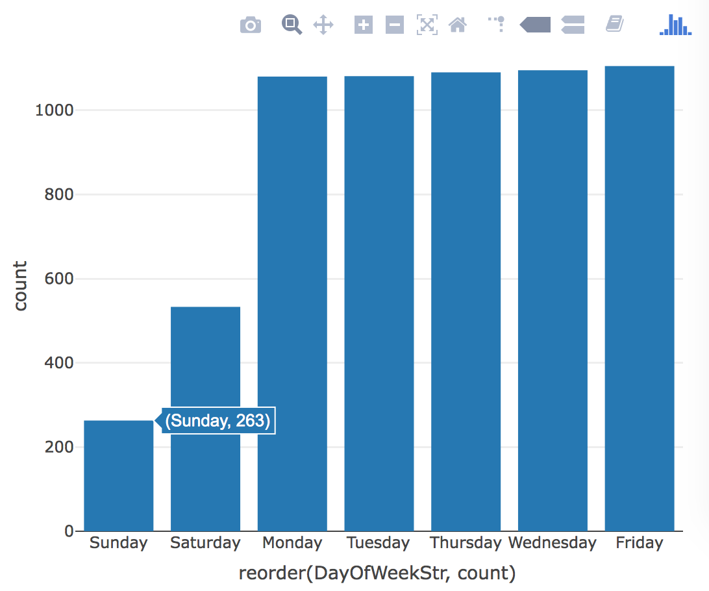

> ### Learning Objectives
>
> - Work with the package `"stringr"`
> - String manipulation
> - More regular expressions
> - A bit of data cleaning
> - First contact with `"plotly"`
> - Making some maps

```{r setup, include=FALSE}
knitr::opts_chunk$set(echo = TRUE, fig.path = 'lab10-images/')
library(stringr)
library(ggmap)
library(plotly)
```

------

## Motivation

So far we've been working with data sets that have been already cleaned, and 
can be imported in R ready to be analyzed.

Today we are going to deal with a "messy" dataset. Most real life data 
sets require a pre-processing phase, and most of the time spent in any data 
analysis project will involve getting the data in the right shape. So it is 
extremely important that you gain skills for cleaning raw data.


### Packages `"stringr"`, `"plotly"`, and regex cheatsheet

For this lab, you will be using the R packages `"stringr"` and `"plotly"`

```{r eval = FALSE}
# you may need to install the packages
# install.packages("stringr")
# install.packages("plotly")
library(dplyr)
library(stringr)
library(plotly)
```

-----

### Get your own copy of the data

Download a copy of the file to your working directory. Here's the code wiht R's  `download.file()` function (or you could also use `curl` from the command line):

```{r eval = FALSE}
github <- "https://raw.githubusercontent.com/ucb-stat133/stat133-spring-2018/master/"
datafile <- "data/mobile-food-sf.csv"
download.file(paste0(github, datafile), destfile = "mobile-food-sf.csv")
```


### Import data table in R

Once you've downloaded the data file, you can read it in R:

```{r eval = FALSE}
dat <- read.csv('mobile-food-sf.csv', stringsAsFactors = FALSE)
```

```{r echo = FALSE}
dat <- read.csv('../data/mobile-food-sf.csv', stringsAsFactors = FALSE)
```

The variables are:

- `DayOfWeekStr`
- `starttime`
- `endtime`
- `PermitLocation`
- `optionaltext`
- `ColdTruck`
- `Applicant`
- `Location`


-----

## Plots with `"plotly"`

Let's begin using functions from the package `"plotly"` which allows you to
produce nice interactive graphics rendered in html form. Keep in mind the plotly
graphs will work as long as your output document is in html format
(i.e. knitting `html_document` is okay). However plotly graphs WON'T work when 
knitting `github_output`.

Consider the variable `DayOfWeekStr` which contains the day of the week in 
string format. Let's calculate the frequencies (i.e. counts) of the categories
in this column and visualize them with a bar-chart:

```{r day_barchart}
day_freqs <- table(dat$DayOfWeekStr)

barplot(day_freqs, border = NA, las = 3)
```

An alternative bar-chart can be obtained with `"plotly"`. You can use the
function `plot_ly()` in a similar way to base-R `plot()`:

```{r eval = FALSE}
plot_ly(x = names(day_freqs), 
        y = day_freqs,
        type = 'bar')
```

Interestingly, you can also use `plot_ly()` in a similar way to `ggplot()`. To use `plot_ly()` in this way, the data to be graphed must have the in data.frame (or tibble):

```{r}
# day frequencies table
day_counts <- dat %>% 
  select(DayOfWeekStr) %>%
  group_by(DayOfWeekStr) %>%
  summarise(count = n()) %>%
  arrange(desc(count))

day_counts
```

Having obtained `day_counts`, you can pass it to `plot_ly()` and then __map__
the columns `DayOfWeekStr` and `Count` to the `x` and `y` attributes, and the
`type = 'bar'` argument:

```{r eval = FALSE}
plot_ly(day_counts, 
        x = ~DayOfWeekStr, 
        y = ~count,
        type = 'bar')
```

Notice the use of the tilder `"~"` to specify the mapping, that is: linking a visual attribute with the column name from a data frame.

To order the bars in increasing order, you need to `reorder()` the values on the x-axis:

```{r eval = FALSE}
plot_ly(day_counts, 
        x = ~reorder(DayOfWeekStr, count), 
        y = ~count,
        type = 'bar')
```



-----

## Changing Times

Let's begin processing the values in column `starttime`. The goal is to obtain 
new times in 24 hr format. For example, a starting time of `10AM` will be 
transformed to `10:00`. Likewise, a starting time of `1PM` will be
transformed to `13:00`.

We are going to be manipulating character strings. Hence, I recommend that you
start working on a small subset of values. Figure out how to get the
answers working on this subset, and then generalize to the entire data set.

Consider the first starting time that has a value of `10AM`. To get a better 
feeling of string manipulation, let's create a toy string with this value:

```{r}
# toy string
time1 <- '10AM'
```


### Function `str_sub()`

To get the time and period values, you can use `str_sub()`:

```{r}
# hour
str_sub(time1, start = 1, end = 2)

# period
str_sub(time1, start = 3, end = 4)
```

__Your turn__: What about times where the hour has just one digit? For example: `9AM`, or `8AM`? Create the following vector `times` and try to subset the hour and the periods with `str_sub()` 

```{r}
times <- c('12PM', '10AM', '9AM', '8AM', '2PM')

# subset time
hours <- str_sub(times, 0, -3)

# subset period
time <- str_sub(times, -2)

#
```

One nice thing about `str_sub()` is that it allows you to specify negative values for the `start` and `end` positions. Run the command below and see what happens:

```{r eval = FALSE}
# period
str_sub(times, start = -2)
```


### Function `str_replace()`

The tricky part with the vector `times` is the extraction of the hour. One 
solution is to "remove" the characters `AM` or `PM` from each time. You can do 
this with the substitution function `str_replace()`:

```{r}
str_replace(times, pattern = 'AM|PM', replacement = '')
```


### Your Turn

So far you've managed to get the hour value and the period (AM or PM). Now:

- Use `plot_ly()` to make a barchart of the counts for `AM` and `PM` values.
```{r}
time_freq <- table(times)
plot_ly(x = names(time_freq),
        y = time_freq,
        type = 'bar')
```

- Write R code to create a vector `start24` that contains the hour in 24hr scale.
```{r}
converter <- function(str){
  hours <- str_sub(str, 0, -3)
  times <- str_sub(str , -2)
  if(times == "AM"){
    return(as.numeric(hours))
  }
  else{
    return(as.numeric(hours)+ 12)
  }

}

lapply(times, converter)
```


- Add two columns `start` and `end` to the data frame `dat`, containing
the starting and ending hour respectively (columns must be `"numeric"`).
```{r}
dat$start <- sapply(dat$starttime, converter)
dat$end <- sapply(dat$endtime, converter)
dat$duration <-  dat$end - dat$start 
```

-----

## Latitude and Longitude Coordinates

Another interesting column in the data is `Location`. If you look at this 
column, you will see values like the following string `loc1`

```{r}
loc1 <- "(37.7651967350509,-122.416451692902)"
```

The goal is to split `Location` into latitude and longitude. The first value
corresponds to latitude, while the second value corresponds to longitude.

First we need to remove the parenthesis. The issue here is that the characters
`(` and `)` have special meanings; recall they are metacharacters. So you need 
to __escape__ in R them by pre-appending two backslashes: `\\(` and `\\)`

```{r}
# "remove" opening parenthesis 
str_replace(loc1, pattern = '\\(', replacement = '')

# "remove" closing parenthesis
str_replace(loc1, pattern = '\\)', replacement = '')
```

You can also combine both patterns in a single call. But be careful:

```{r}
str_replace(loc1, pattern = '\\(|\\)', replacement = '')
```

`str_replace()` replaces only the first occurrence of `(` or `)`. However, the
location values contain both opening and closing parentheses. To replace them
all, you have to use `str_replace_all()`

```{r}
str_replace_all(loc1, pattern = '\\(|\\)', replacement = '')
```

Now we need to get rid of the comma `,`. You could replace it with an empty
string, but then you will end up with one long string like this:

```{r}
lat_lon <- str_replace_all(loc1, pattern = '\\(|\\)', replacement = '')

str_replace(lat_lon, pattern = ',', replacement = '')
```

Instead of replacing the comma, what we need to use is `str_split()`

```{r}
# string split in stringr
str_split(lat_lon, pattern = ',')
```

Notice that `str_split()` returns a list.


### Manipulating more location values

Let's define a vector with more location values, so we can start generalizing
our code:

```{r}
locs <- c(
  "(37.7651967350509,-122.416451692902)",
  "(37.7907890558203,-122.402273431333)",
  "(37.7111991003088,-122.394693339395)",
  "(37.7773000262759,-122.394812784799)",
  NA
)
```

- use `str_split()` to create a list `lat_lon` containing the latitude and the longitude values of `locs`

Assuming that you have `lat_lon`, to retrieve the latitude and longitude values, you can use the `lapply()` 
function, and then specify an _anonymous_ function to get the first element 
(for the latitude): 

```{r}
lat <- lapply(lat_lon, function(x) x[1])
```

### Your Turn

Create a list `lon` by using `lapply()` with an anonymous 
function to extract longitude value (i.e. the second element):

```{r echo = FALSE}
lon <- lapply(lat_lon, function(x) x[2])
```

To convert from list to a vector, use `unlist()`

```{r warning=FALSE}
lat <- as.numeric(unlist(lat))
lon <- as.numeric(unlist(lon))
```

Add two more columns: `lat` and `lon` to the data frame `dat`


```{r echo = FALSE}
lat_lon <- str_split(
  str_replace_all(dat$Location, pattern = '\\(|\\)', replacement = ''), 
  pattern = ',')

lat <- lapply(lat_lon, function(x) x[1])
lon <- lapply(lat_lon, function(x) x[2])

dat$lat <- as.numeric(unlist(lat))
dat$lon <- as.numeric(unlist(lon))
```

-----

