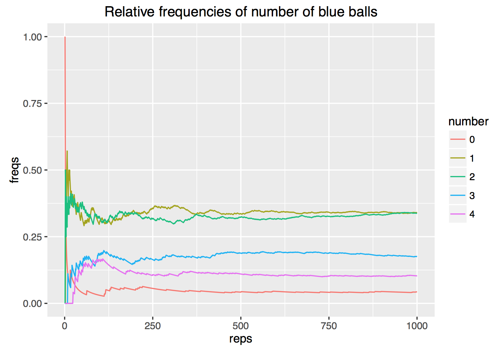

> ### Learning Objectives
>
> - getting started with simulations in R
> - learn how to create a basic shiny app
> - put in practice concepts from your introductory statistics course(s)

```{r setup, include=FALSE}
knitr::opts_chunk$set(echo = TRUE, error = TRUE, fig.path = 'lab11-images/')
```

------


# Introduction 

Random numbers have many applications in science and computer programming,
especially when there are significant uncertainties in a phenomenon of interest.


# Computing Probabilities

With the mathematical rules from probability theory we can compute the 
probability that a certain event happens. Consider for example two bags
containing balls of different colors. Bag 1 contains 2 white balls and 1 red 
ball; bag 2 contains 3 white balls and 1 red ball. 

Suppose that a bag is chosen at random, and then a ball is picked at random 
from the selected bag. What is the given probability that:

a. the ball chosen is red
b. the ball chosen is white

This problem can be solved analytically using the formulas:

```
P(red) = P(red | bag1) P(bag1) + P(red | bag2) P(bag2)

P(white) = P(white | bag1) P(bag1) + P(white | bag2) P(bag2)
```

Instead of solving this problem analytically, you can write R code to simulate 
the experiment of picking a bag and drawing a ball. The first step consists of 
creating two bags as character vectors with the name of the colors for the balls:

```{r}
# bags
bag1 <- c('white', 'white', 'red')
bag2 <- c(rep('white', 3), 'red')
```

To compute the probability using simulations, we need to replicate the 
random experiments a large number of times (e.g. 500 or 1000 times).

```{r}
bags <- c('bag1', 'bag2')
repetitions <- 1000
drawn_balls <- character(repetitions)

set.seed(345)
for (i in 1:repetitions) {
  # select one bag
  chosen_bag <- sample(bags, 1)
  
  # draw a ball from chosen bag
  if (chosen_bag == 'bag1') {
    drawn_balls[i] <- sample(bag1, 1)
  } else {
    drawn_balls[i] <- sample(bag2, 1)
  }
}

table(drawn_balls)
```


# A less basic probability problem

You can manually find the probabilities of the previous example. However, not
all real problems have an analytic solution. Consider the following situation.
There are two boxes with balls of different colors. Box 1 contains two `blue`
balls, and one `red` ball. Box 2 contains two `blue` balls, three `red` balls,
and one `white` ball.

The random experiment consists of generating a random number that follows a
uniform distribution (min = 0, max = 1). If the number is greater than 0.5,
then a sample __with replacement__ of size 4 is drawn from box 1. If the
random number is less than or equal to 0.5, then a sample __without replacement__
of size is drawn from box 2. The goal is to find the probability distribution 
for the number of blue balls. In other words: 

- Probability of 0 blue balls
- Probability of 1 blue ball
- Probability of 2 blue balls
- Probability of 3 blue balls
- Probability of 4 blue balls


### Your Turn

1. Create two character vectors `box1` and `box2` with colors of balls:

```{r}
box1 <- c(rep('blue', 2), 'red')
box2 <- c(rep('blue', 2), rep('red', 3), 'white')
```


2. The random experiment involves generating a uniform random number using 
`runif(1)`. If this number is greater than 0.5, get a `sample()` without 
replacement of `size = 4` from `box1.` Otherwise, get a `sample()` without 
replacement of `size = 4` from `box2`.

```{r}
boxes <- c('box1', 'box2')
repetitions <- 1000
drawn_balls <- character(repetitions)
possibleBlue <- numeric(5)
for (i in 1:5) {
  possibleBlue[i] = 0
}
for (i in 1:repetitions) {
  # select one bag
  num <- runif(1)
  
  # draw a ball from chosen bag
  if (num > 0.5) {
    drawn_balls[i] <- list(sample(box1, 4, replace = TRUE))
  
  } else {
    drawn_balls[i] <- list(sample(box2, 4))
  }
  blue <- as.numeric(table(drawn_balls[i])["blue"]) + 1
  if(is.na(blue)){
    possibleBlue[1] = possibleBlue[1] + 1
  }
  else {
    possibleBlue[blue] = possibleBlue[blue]+1
  }
}
```
```{r}
possibleBlue
```

3. Repeat the experiment 1000 times using a `for` loop. To store the drawn 
samples, use a matrix `drawn_balls`. This matrix will have 1000 rows and 4 columns.
In each row you assign the output of a random sample of balls.


Your matrix `drawn_balls` could look like this (first five rows):

```
     [,1]   [,2]    [,3]    [,4]   
[1,] "blue" "red"   "red"   "blue" 
[2,] "red"  "blue"  "white" "red"  
[3,] "red"  "blue"  "red"   "red"  
[4,] "red"  "red"   "red"   "blue" 
[5,] "red"  "red"   "blue"  "white"
```


4. Once you filled the matrix `drawn_balls`, compute the proportion of samples
containing: 0, 1, 2, 3, or 4 blue balls.

5. Try to obtain the following plot showing the relative frequencies of number
of blue balls over the series of repetitions.

```{r freq_plot, fig.width=2, out.width='80%', echo = FALSE, fig.align='center'}

```
